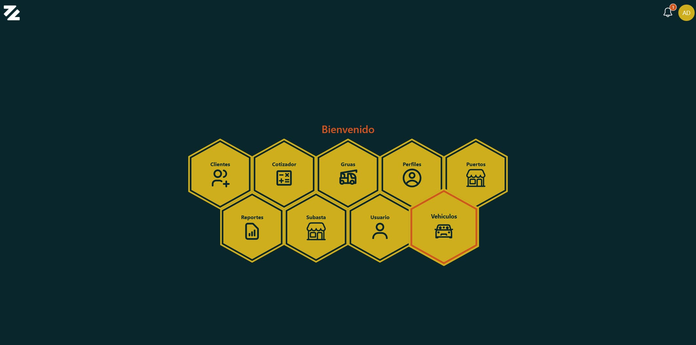

# 📋 SmartLogistic - CRM

  

SmartLogistic es un sistema de gestión de exportacion de vehículos, permitiendo a la empresa poder gestionar, cotizar, registrar y exportar los vehículos de manera eficiente y segura. Actualmente se encuentra en fase de desarrollo y planificación, pero el objetivo es poder ofrecer una solución completa para la gestión de exportación de vehículos.

## 🚀 Tecnologías utilizadas  
- [Node.js](https://nodejs.org/es/)
- [Express.js](https://expressjs.com/)
- [TypeORM](https://typeorm.io/)
- [Socket.io](https://socket.io/docs/v4)
- [MySQL](https://www.mysql.com/)
- [React.js](https://react.dev/)
- [Ant Design](https://ant.design/)
- [Firebase](https://firebase.google.com/)

## Settings 🔧
### 💻 Environment Variables
Crea un archivo con el nombre `.env` puedes copiar el archivo `.env.example` y modificarlo según tus necesidades.

## 📦 Instalación
```bash
npm install
```

## 🚀 Iniciar el servidor
```bash
npm run dev
```

## 📦 Docker
```bash
docker-compose up -d
```